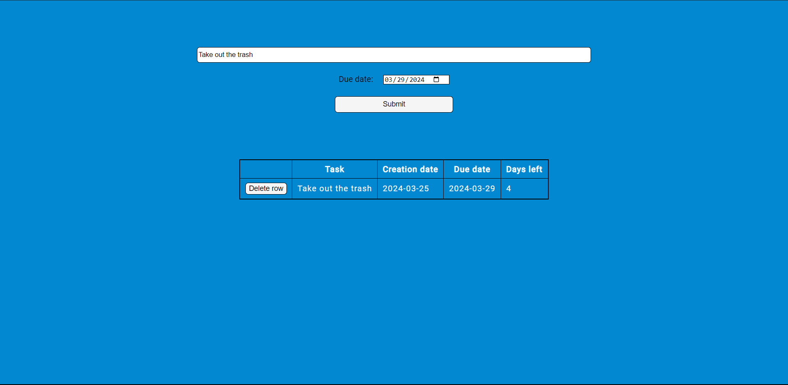

## TODO App

[https://a2-carlosmedina.glitch.me/](https://a2-carlosmedina.glitch.me/)

I made a simple TODO app with flex-box styling. To use, input your task name into the text input, create a due date now or in the future, and hit submit. Every time the submit button is clicked, the updated list is retrieved from the server and displayed in a new table underneath the submit form.

## Technical Achievements

- **Tech Achievement 1**: Created a single-page TODO app that allows for simple tasks to be sent to a server, and for the server to send back a list of all tasks it has received.

- **Tech Achievement 2**: Created a form to send data. This form has a text entry and a date entry. Additionally validates text input to ensure there are no blank entries. Dynamically sets the `min` and `value` properties of the date chooser to ensure tasks cannot be set to be due in the past.

- **Tech Achievement 3**: Created a table to display server-side data. The server takes in data from the aforementioned form and performs a days-until-due calculation. It then adds this to a list of previously submitted tasks and returns this to the client as a response.The table displays this data, one entry per row.

- **Tech Achievement 4**: Created buttons that send a delete request to the server to remove a task from its storage. Refreshes the table with the updated list.

- **Tech Achievement 5**: Used flexbox styling on `form` and `table` elements. Additionally, there are CSS rules targeting class, element, and id selectors for styling round corners, making better looking buttons, changing colors, adding table borders, and creating some padding inside table data entries. I used Google Fonts to load Roboto with additional fallbacks incase this request fails.

### Design/Evaluation Achievements

- **Design Achievement 1**: Ku (Not in class but took software engineering and made React.js app). His main critiques were the lack of Aria labels, the table remaining after all elements were deleted, have bigger buttons, have bigger font, have an additional label above the text entry--perhaps the words "TODO App", and add server-side rendering so that the first paint of the website has a table that is pre-populated with the current tasks on the server (so that reloads don't clear the table).

I think the reasonable changes are all of the ones except SSR. I agree that these are useful and should be implemented.

- **Design Achievement 2**: Caissie. He said that the modification of a task could be easier or more clear--modifying the table directly would be most intuitive, but perhaps a tooltip on submit or on the text entry would be easier.

I think this would be a cool change, but might be rather involved creating a custom table element to facilitate this.
